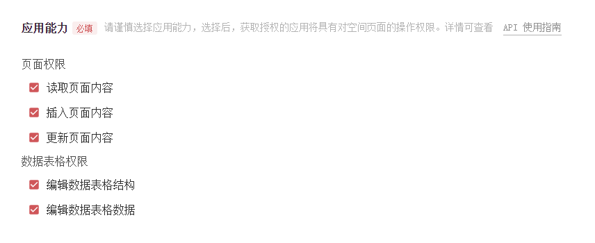
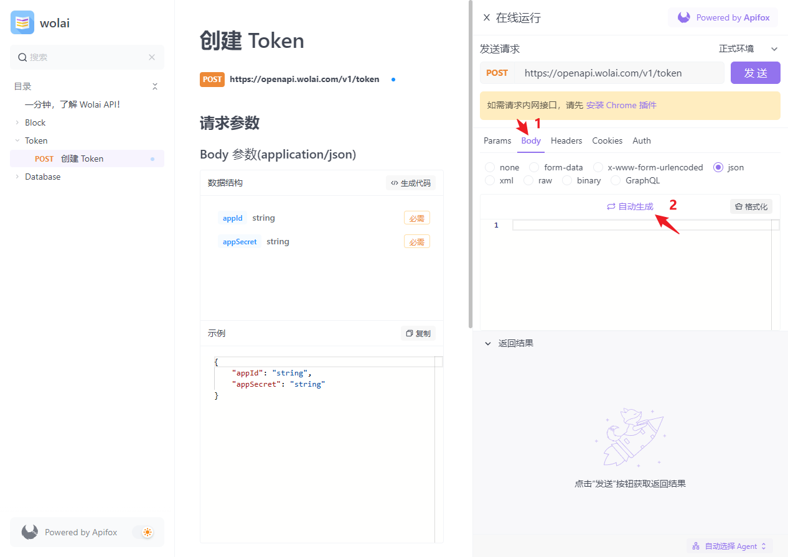
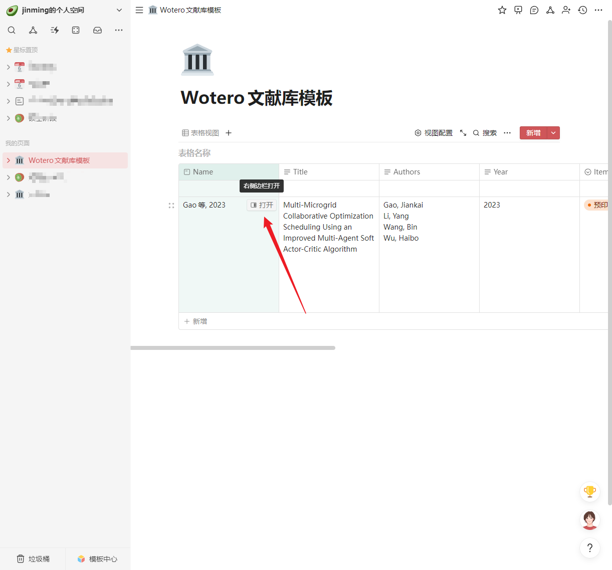

# Wotero

Wotero 是一个[Zotero 插件](https://www.zotero.org/support/plugins)，用来实现 Zotero 和[Wolai](https://www.wolai.com/)之间的文献互联。

## 目录

- [Wotero 的工作原理](#wotero的工作原理)
- [安装与使用](#安装与使用)
- [wolai 笔记创建流程分享](#wolai笔记创建流程分享)
- [感谢](#感谢)

## 为什么使用 Wotero

- Allows you to integrate your reference manager, task list, reading notes,
  analytical tables, and drafts in one location.
- The name of database entries is the in-text citation, which allows you to
  easily link to references when writing in Notion.
- Create custom views to filter and sort large reference lists by project,
  tag, author, etc.
- Backlinks make it easy to locate any of the notes and drafts that mention
  a reference.
- Link references to entries in other databases, such as projects, tasks,
  manuscripts in your publication pipeline, publishing outlets, etc.

## Wotero 的工作原理

Wotero 的工作原理与[Notero](https://github.com/dvanoni/notero)完全相同。事实上，Wotero 是在 Notero 的 fork 版本上改进而来，因此我也很乐意使用"原插件名+wolai"来命名这个插件。但是 Notero 即 Notion+Zotero ，再加上 wolai 的后缀就显得相当奇怪，所以我借鉴原作者的命名巧思，将此款插件命名为 Wotero，即 Wolai+Zotero。

### 文献同步

当受监视的文件夹中出现新文献时，Wotero 会自动将其同步到指定的 Wolai 数据库中。

_Notero 还能在用户修改某个 Zotero 文献的信息后自动更新其对应的 Notion 数据行，这个功能通过**当修改条目时同步**开启或者关闭。由于 Wolai 暂时没有发布更新数据表格中指定行的 API，Wotero **暂时不支持**此功能，默认关闭。如下图所示_

## 安装与使用

### Wotero 的安装

点击打开 Wotero 安装步骤

1. 从 [这里](https://github.com/imzhangjinming/Wotero/releases/tag/v0.0.3) 下载以 `.xpi` 结尾的插件包。

2. 打开 Zotero，选择 **工具 -> 附加组件** 打开插件管理页面，点击右上角的齿轮图标，选择 **Install Add-on From File...**，在弹出的窗口选择刚刚下载的 `.xpi` 文件，点击打开，即可完成插件的安装。

出现如下页面说明插件安装成功

### 配置 Wotero

⚠️ _**Note:** 目前 wolai 官方的 API 还在测试阶段，使用插件需要申请 wolai 的开发者内测权限，配置有些许麻烦，有刚需的童鞋可以按照下面的教程（非常详细，保姆级教程）申请权限并配置 Wotero ，没有刚需的童鞋可以等待正式版发布后再试！_

#### 在配置 Wotero 前，首先要进行 Wolai 的配置，具体步骤如下

  
点击打开 Wolai 配置步骤

1. 打开 [Wolai 开发者页面](https://www.wolai.com/wolai/7FB9PLeqZ1ni9FfD11WuUi)，点击 **wolai API 开发者内测申请**，如下图所示。

填写申请表单并提交，等待管理员审核（审核速度挺快的，一般当天就会同意）。

2. 获得内测资格后，打开 Wolai，点击左上角 **xxx 的个人空间->个人头像** 进入个人空间设置

   

3. 选择 **空间相关** 栏下的 **应用设置**，点击右上角 **创建和管理应用**

   

4. 点击 **创建新应用**， 按要求填写应用的基本信息，**应用能力**部分建议全部勾选，勾选完成后点击 **提交**

   

5. 提交后会显示应用凭证页面，这里给了两个值：App ID 和 App Secret，这两个值非常重要，一定要保存好，后面获取 App Token 时要用到

   

6. 接着打开[Wolai API 调试页面](https://apifox.com/apidoc/shared-bc5c042c-3483-4369-acc0-a5609b270c4d/doc-731955)，点击 **Token -> 创建 Token**

   

7. 点击 **调试**

   

8. 在 **Body** 选项卡下点击 **自动生成**

   

9. 将第 5 步得到的 App ID 和 App Secret 填入自动生成的 Body 体中

   ⚠️ _**Note:** `"appId":` 和 `"appSecret":`后面双引号里自动生成的随机值要删除，并分别填入第 5 步获得的 App ID 和 App Secret ，一定要确保这两个值是被英文双引号 `""`围起来的_

   

10. 点击 **发送**，**返回响应**里 **Body** 选项卡下显示了收到的数据，复制 app_token 对应的值（不包含双引号），这个值非常重要，整个配置阶段的最终目标就是获取这个 app_token 值。

    

11. 回到 Wolai ，创建一个数据库，这里建议大家使用[我的文献库模板](https://www.wolai.com/aFvfSjc1eQ3ED2T5cp3GM6)，确保插件能够正常运行。
    打开文献库模板后点击右上角的**复制**，然后该模板就能保存到你的 Wolai 空间了（可能需要登录）。

    在 Wolai 中打开刚刚保存的模板，点击数据表格左上角的小图标

    

    选择 **复制引用视图链接**

    

    然后在空白处粘贴，斜杠 `/` 和问号 `?` 之间的字符串就是我们需要的 数据库 ID，把它复制下来保存好

    

至此，我们已经得到了 appToken 和 数据库 ID，Wolai 方面的配置就完成了。

#### Wotero 插件的配置

  
点击打开 Wotero 配置步骤

1. 在Zotero中，选择 **工具 -> Wotero首选项** 打开Wotero配置页面。将之前获得的 appToken 和 数据库 ID 分别填入 Wolai appToken 和 数据库 ID，按照说明选择想要监视的文件夹，确保 **当修改条目时同步** 取消勾选

2.  点击 OK，保存设置

3.  现在向某一受监视的文件夹内加入新的文献，Zotero 会弹出显示同步状态的浮窗

    

    同步完成后，也会显示相关信息

    

4.  回到 Wolai 文献库页面，发现刚刚添加的文献已经同步了！如果同步后在 Wolai 中看不到新文献行，稍微等一下，或者重启 Wolai 强制刷新。

    

5.  除了添加新文献时自动同步，你也可以通过右键单击手动将文献同步到 Wolai

          - 如果要同步某一文件夹下的所有文献，右键单击想同步的文件夹并选择 **Sync Items to Wolai**；
          - 如果要同步某一文献，右键单击该文献并选择 **同步到Wolai**。

    

## wolai 笔记创建流程分享

[Zotero Connector](https://www.zotero.org/download/connectors) 提供了从浏览器一键将文献保存至 Zotero 的便利，Wotero 提供了从 Zotero 一键同步至 Wolai 的便利，而 Wolai 作为论文笔记的最后一站，如果能够一键生成论文阅读笔记模板，那么从网页到写笔记的过程将会非常顺滑。

今天将自己创建笔记模板的步骤分享给大家：

点击打开笔记模板创建步骤

1. 创建一个普通的 Wolai 页面，页面内容是论文笔记的模板，就像下面这样

2. 点击 Wolai 左上角 **xxx 的个人空间 -> 个人头像** 进入空间设置页面，选择空间相关下的 **个人偏好** 页面，下滑至 **自定义模板** ，点击 **选择页面**

搜索并选择刚刚创建的笔记模板页面的名字，选中模板页面（我这里是 Thesis note template）

点击右下角保存

这样模板就设置好了

3. 现在向 Zotero 受监视的文件夹内添加一篇新文献，文献自动同步到 Wolai 文献库中，点击该文献对应行的 **打开** 按钮

4. 在弹出的文献详细内容页面选择论文笔记模板，即可创建模板并开始笔记

5. 整个流程非常顺滑，凭借 Zotero Connector、Wotero 和 Wolai 的联动，从发现论文、保存论文到开始阅读论文并记笔记的流程只需**几秒钟**。

## 感谢

- [Notero](https://github.com/dvanoni/notero)
- [Zotero 插件开发中文文档](https://zotero.yuque.com/staff-gkhviy/developer?spm=wolai.workspace.0.0.71ac37e07ColPK)
